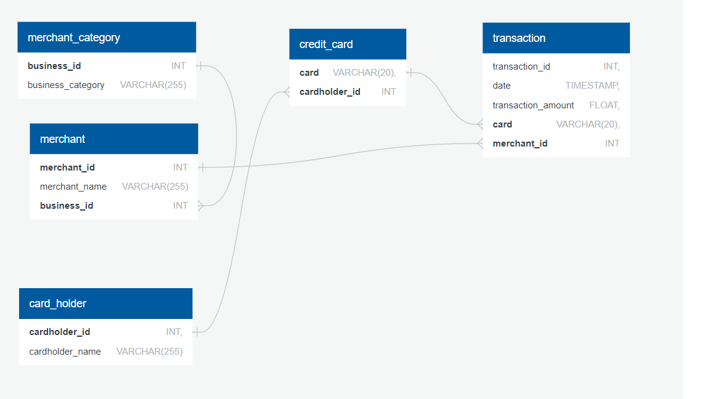

# Credit Card Fraud Detection

After data modeling, PostgreSQL, Python and Pandas are used to create a database and look for outliers to detect credit card fraud. This was a homework assignment under Northwestern's Fintech Bootcamp.

## Getting Started

This project was done on a Jupyter notebook, which means there is no need to run this as an "app". A Jupyter notebook contains python code and displays the results of the code on the same page when running on a local computer with all dependencies installed. But no need to install libraries. Just open up the ".ipynb" file in the repository and it shows the Python code with its immediate results. If the rendering of graphs is problematic (sometimes github does this), then open the PDF file named "data_visualization_analysis.pdf", which shows all plots.

If actually running the jupyter notebook is desired, then install all necessary libraries with "pip install 'x'" where 'x' is:
- sqlalchemy
- pandas
- calendar
- hvplot

Also, it is required to install postgreSQL in one's local machine and make a database. Then feed the SQL data inside the data folder called "all_tables" to create all the necessary tables in the database. Then connect to the database through sqlalchemy using the appropriate path and database name.

## Project Overview
First a relationship was established from exploring various SQL files located in the Data folder. Relationships were found between the tables and a Quick Database Diagram was drawn:

Then the database was made using PostgreSQL on a local machine. After that, data was pulled and analyzed using Python and Pandas. 

In this assignment, we first investigated whether cardholders 2 and 18 were hacked. We cleaned up the data so that only their transactions were shown and plotted them against each other. Due to sudden bursts of expenditure in cardholder 18 sometimes in the amount of approximately $2000, it was found to be suspect, while the expenses of cardholder 2 seem to be fine:

Next we looked at whether cardholder 25 was using her company's credit card in illegitmate ways for personal expenditures. Once again, we cleaned up the data by isolating her cards, and through a box plot we can see whether there are unusual expenditures and how often they occur:

It seems as though there are a few outliers in the expenditures of cardholder 25. There is about one outlier per month, sometimes in the amount of over $1000. February did not have any but April had three outliers.

